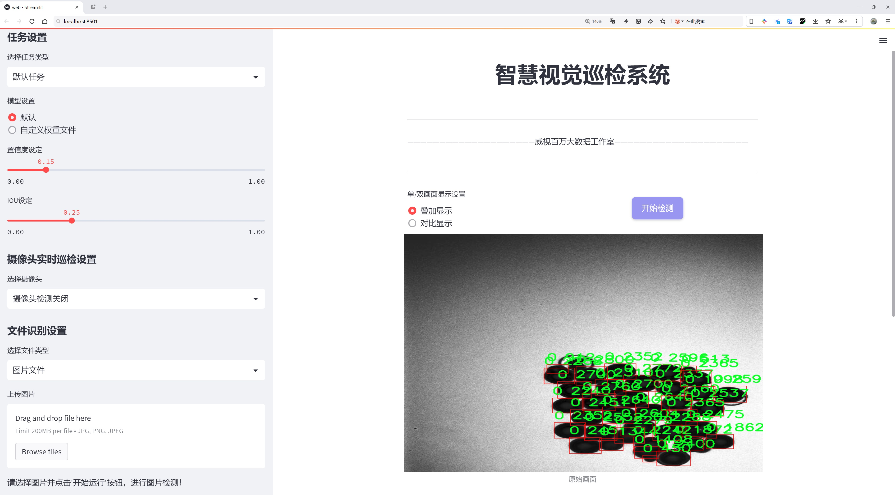
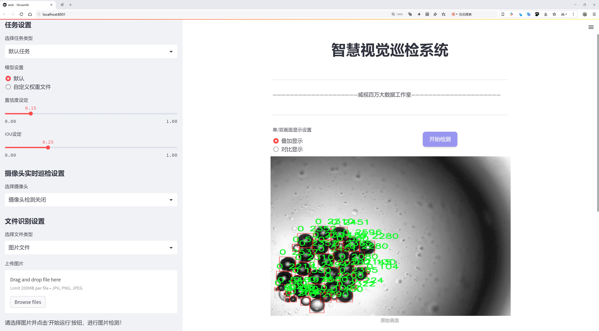
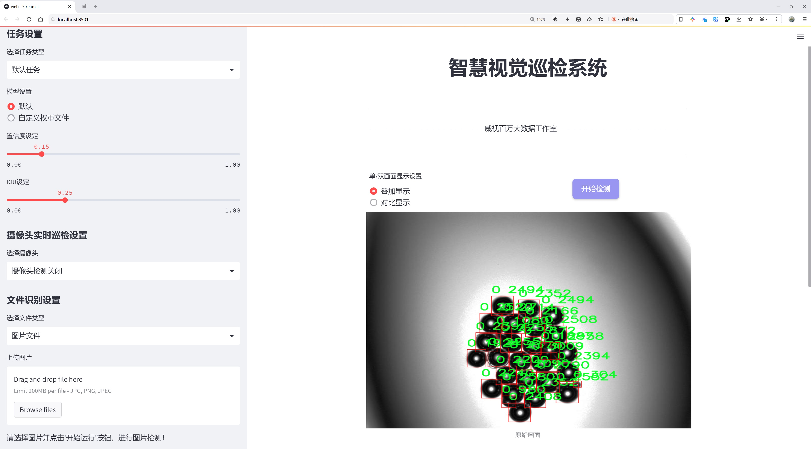
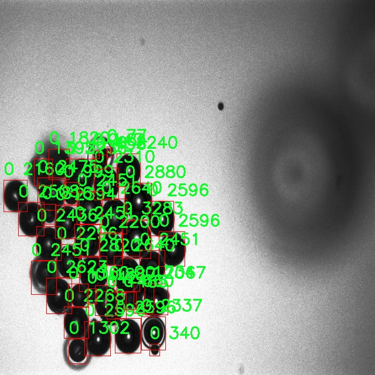
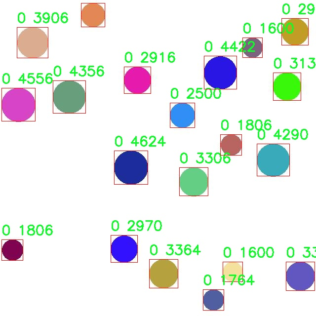
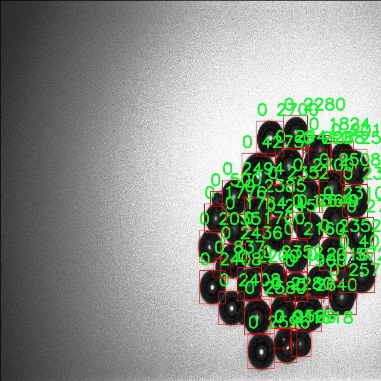
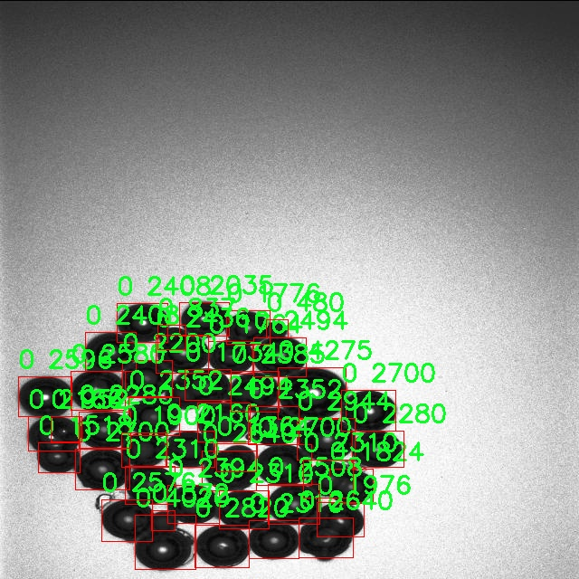
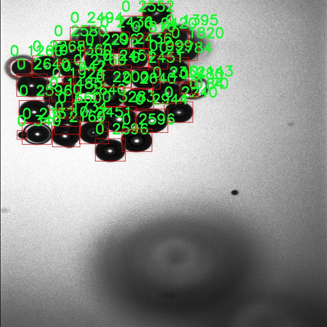

# 圆形物体检测检测系统源码分享
 # [一条龙教学YOLOV8标注好的数据集一键训练_70+全套改进创新点发刊_Web前端展示]

### 1.研究背景与意义

项目参考[AAAI Association for the Advancement of Artificial Intelligence](https://gitee.com/qunshansj/projects)

项目来源[AACV Association for the Advancement of Computer Vision](https://gitee.com/qunmasj/projects)

研究背景与意义

随着计算机视觉技术的迅猛发展，物体检测作为其核心任务之一，已广泛应用于自动驾驶、智能监控、机器人导航等多个领域。近年来，YOLO（You Only Look Once）系列模型因其高效的实时检测能力而受到广泛关注，尤其是YOLOv8的推出，使得物体检测的精度和速度得到了显著提升。然而，现有的YOLO模型在特定形状物体的检测上仍存在一定的局限性，尤其是在圆形物体的检测任务中，传统的矩形边界框方法往往无法有效地捕捉到圆形物体的特征，导致检测精度下降。因此，基于改进YOLOv8的圆形物体检测系统的研究显得尤为重要。

本研究的目标是针对圆形物体的特性，提出一种改进的YOLOv8模型，以提高圆形物体的检测精度和效率。通过对YOLOv8模型的结构进行优化，结合圆形物体的几何特征，设计出一种新的检测算法，能够更好地适应圆形物体的形状特征。这一研究不仅有助于提升圆形物体的检测性能，还为其他特定形状物体的检测提供了新的思路和方法。

在数据集方面，本研究使用了包含3000张图像的圆形物体检测数据集。该数据集专门针对圆形物体的特征进行了标注，确保了模型训练的有效性和准确性。数据集中仅包含一个类别，即圆形物体，这使得模型能够集中学习该类别的特征，避免了多类别干扰带来的复杂性。通过对这一数据集的深入分析与处理，研究将探索如何在不同的环境和条件下提高圆形物体的检测能力。

本研究的意义不仅在于提升圆形物体的检测精度，更在于推动计算机视觉领域的进一步发展。随着智能化程度的提高，越来越多的应用场景需要对特定形状物体进行精确识别和定位。改进YOLOv8的圆形物体检测系统将为这些应用提供强有力的技术支持，尤其是在工业自动化、交通监控和安全防范等领域，能够显著提高系统的智能化水平和工作效率。

此外，本研究还将为后续的研究提供重要的理论基础和实践经验。通过对YOLOv8模型的改进与优化，研究将为其他形状物体的检测提供可借鉴的经验，推动物体检测技术的多样化发展。同时，研究结果也将为相关领域的研究者提供数据支持和算法参考，促进学术界与工业界的合作与交流。

综上所述，基于改进YOLOv8的圆形物体检测系统的研究，不仅具有重要的学术价值和应用前景，更为计算机视觉技术的创新与发展提供了新的思路和方向。通过这一研究，期望能够在圆形物体检测领域取得突破性进展，为相关行业的智能化发展贡献力量。

### 2.图片演示







##### 注意：由于此博客编辑较早，上面“2.图片演示”和“3.视频演示”展示的系统图片或者视频可能为老版本，新版本在老版本的基础上升级如下：（实际效果以升级的新版本为准）

  （1）适配了YOLOV8的“目标检测”模型和“实例分割”模型，通过加载相应的权重（.pt）文件即可自适应加载模型。

  （2）支持“图片识别”、“视频识别”、“摄像头实时识别”三种识别模式。

  （3）支持“图片识别”、“视频识别”、“摄像头实时识别”三种识别结果保存导出，解决手动导出（容易卡顿出现爆内存）存在的问题，识别完自动保存结果并导出到tempDir中。

  （4）支持Web前端系统中的标题、背景图等自定义修改，后面提供修改教程。

  另外本项目提供训练的数据集和训练教程,暂不提供权重文件（best.pt）,需要您按照教程进行训练后实现图片演示和Web前端界面演示的效果。

### 3.视频演示

[3.1 视频演示](https://www.bilibili.com/video/BV1Yt4behEU6/)

### 4.数据集信息展示

##### 4.1 本项目数据集详细数据（类别数＆类别名）

nc: 1
names: ['0']


##### 4.2 本项目数据集信息介绍

数据集信息展示

在现代计算机视觉领域，物体检测技术的进步为许多应用场景提供了强有力的支持。为了提升YOLOv8在圆形物体检测方面的性能，我们构建了一个专门的数据集，命名为“circle detection”。该数据集的设计旨在为圆形物体的识别和定位提供高质量的训练样本，从而改进YOLOv8模型的检测精度和鲁棒性。

“circle detection”数据集包含了丰富的圆形物体图像，经过精心挑选和标注，确保每个样本都能有效地反映出圆形物体的特征。该数据集的类别数量为1，具体类别列表中仅包含一个类别，标记为“0”。这一设计的目的在于专注于圆形物体的检测，避免其他形状的干扰，从而使模型能够更专注于学习圆形物体的特征。尽管类别数量较少，但每个样本的多样性和复杂性却为模型的训练提供了丰富的背景信息。

数据集中包含的图像来源广泛，涵盖了不同的场景和光照条件，确保模型在各种环境下都能表现出色。这些图像包括了不同尺寸、颜色和材质的圆形物体，诸如球体、圆盘、圆形标志等。通过对这些图像的多样化处理，数据集能够有效模拟现实世界中可能遇到的各种情况，增强模型的泛化能力。

为了确保数据集的高质量，我们对每张图像进行了详细的标注，采用了精确的边界框标注技术，以准确地圈定每个圆形物体的位置。每个标注不仅包含了物体的位置信息，还包括了物体的尺寸和形状特征。这种详细的标注方式为YOLOv8模型提供了清晰的学习目标，使其能够更好地理解和识别圆形物体的特征。

在数据集的构建过程中，我们还特别考虑了数据的平衡性和代表性。通过对不同类型的圆形物体进行合理的采样，确保了数据集在训练过程中不会因某一类物体的过度代表而导致模型的偏见。这种均衡的设计使得模型在面对新样本时，能够保持良好的检测性能。

总之，“circle detection”数据集为改进YOLOv8的圆形物体检测系统提供了坚实的基础。通过精心设计的样本和高质量的标注，该数据集不仅能够有效提升模型的检测能力，还能为后续的研究和应用提供宝贵的数据支持。随着数据集的不断完善和扩展，我们期待YOLOv8在圆形物体检测领域能够取得更为显著的进展，推动相关技术的进一步发展。











### 5.全套项目环境部署视频教程（零基础手把手教学）

[5.1 环境部署教程链接（零基础手把手教学）](https://www.ixigua.com/7404473917358506534?logTag=c807d0cbc21c0ef59de5)


[5.2 安装Python虚拟环境创建和依赖库安装视频教程链接（零基础手把手教学）](https://www.ixigua.com/7404474678003106304?logTag=1f1041108cd1f708b01a)

### 6.手把手YOLOV8训练视频教程（零基础小白有手就能学会）

[6.1 手把手YOLOV8训练视频教程（零基础小白有手就能学会）](https://www.ixigua.com/7404477157818401292?logTag=d31a2dfd1983c9668658)

### 7.70+种全套YOLOV8创新点代码加载调参视频教程（一键加载写好的改进模型的配置文件）

[7.1 70+种全套YOLOV8创新点代码加载调参视频教程（一键加载写好的改进模型的配置文件）](https://www.ixigua.com/7404478314661806627?logTag=29066f8288e3f4eea3a4)

### 8.70+种全套YOLOV8创新点原理讲解（非科班也可以轻松写刊发刊，V10版本正在科研待更新）

由于篇幅限制，每个创新点的具体原理讲解就不一一展开，具体见下列网址中的创新点对应子项目的技术原理博客网址【Blog】：


[8.1 70+种全套YOLOV8创新点原理讲解链接](https://gitee.com/qunmasj/good)

### 9.系统功能展示（检测对象为举例，实际内容以本项目数据集为准）

图9.1.系统支持检测结果表格显示

  图9.2.系统支持置信度和IOU阈值手动调节

  图9.3.系统支持自定义加载权重文件best.pt(需要你通过步骤5中训练获得)

  图9.4.系统支持摄像头实时识别

  图9.5.系统支持图片识别

  图9.6.系统支持视频识别

  图9.7.系统支持识别结果文件自动保存

  图9.8.系统支持Excel导出检测结果数据


### 10.原始YOLOV8算法原理

原始YOLOv8算法原理

YOLOv8算法是由Ultralytics公司于2023年推出的目标检测模型，它在前几代YOLO版本的基础上进行了重大更新，旨在提高检测精度、速度和灵活性。YOLOv8的设计理念围绕着快速、准确和易于使用的原则，使其成为各种计算机视觉任务的理想选择，包括目标检测、图像分割和图像分类等。其网络结构主要由输入层、主干网络（Backbone）、颈部网络（Neck）和头部网络（Head）组成。

在输入层，YOLOv8默认的输入图像尺寸为640x640像素。然而，在实际应用中，输入图像的长宽比往往各不相同。为了解决这一问题，YOLOv8采用了自适应图像缩放技术。该技术的核心思想是将输入图像的长边按比例缩小到指定尺寸，然后对缩小后的短边进行填充，以尽量减少填充区域，从而降低信息冗余。这种处理方式不仅提高了目标检测的速度，还保持了图像信息的完整性。此外，在模型训练阶段，YOLOv8引入了Mosaic图像增强操作。这一操作通过随机选择四张图像进行缩放和拼接，生成新的训练样本，迫使模型学习不同位置和周围像素的特征，从而有效提升了模型的预测精度和性能。

YOLOv8的主干网络部分是其性能提升的关键所在。与之前的YOLO版本相比，YOLOv8在主干网络中引入了C2F模块，取代了YOLOv5中的C3模块。C2F模块通过并行化更多的梯度流分支，增强了模型的特征提取能力。该模块不仅保证了网络的轻量化，还提高了检测精度和响应速度。YOLOv8的主干网络由多个卷积层和反卷积层构成，结合了残差连接和瓶颈结构，以减小网络的复杂度并提升性能。网络末尾的快速空间金字塔池化（SPPF）模块通过多个最大池化层处理多尺度特征，进一步增强了网络的特征抽象能力。

在颈部网络部分，YOLOv8采用了多尺度特征融合技术，结合了特征金字塔网络（FPN）和路径聚合网络（PAN）的设计思想。这一部分的主要功能是将来自主干网络不同阶段的特征图进行融合，以便更好地捕捉不同尺度目标的信息。这种特征融合策略有效提高了目标检测的性能和鲁棒性，使得YOLOv8能够在复杂场景中表现出色。

YOLOv8的头部网络是其创新之处，尤其是在检测头的设计上。YOLOv8从耦合头（Coupled-Head）转变为解耦头（Decoupled-Head），将检测和分类任务分开处理。在这一结构中，输入的特征图首先通过两个1x1的卷积模块进行降维，然后分别生成类别预测和边界框回归的输出。这种解耦设计不仅提高了模型的灵活性，还改善了检测精度。此外，YOLOv8在损失函数的设计上也进行了优化，取消了目标存在性（Obj）分支，采用二值交叉熵损失（BCELoss）用于分类分支，而在边界框回归分支中使用了分布焦点损失（DFL）和CIoU损失。这一设计旨在使网络模型更快地聚焦于标签附近的数值，从而提高预测的准确性。

YOLOv8还抛弃了传统的基于锚框（Anchor-Based）的方法，转而采用无锚框（Anchor-Free）的方法进行目标检测。这一创新使得YOLOv8不再依赖于预设的锚框来完成目标检测，而是将目标检测问题转化为关键点检测。这种方法的优点在于，模型不需要在训练之前对数据集进行锚框的聚类和参数设置，从而提高了模型的泛化能力和框架的简洁性。

综上所述，YOLOv8算法通过引入自适应图像缩放、Mosaic增强、C2F模块、特征融合、解耦头设计以及无锚框检测等多项创新，显著提升了目标检测的性能和效率。它不仅在COCOval2017数据集上表现出色，而且在实际应用中也展现了极高的灵活性和适应性，使其成为当前目标检测领域的重要工具。随着YOLOv8的不断发展和完善，预计其将在更多的计算机视觉任务中发挥重要作用，推动目标检测技术的进一步进步。


### 11.项目核心源码讲解（再也不用担心看不懂代码逻辑）

#### 11.1 ui.py

以下是经过简化并添加详细中文注释的核心代码部分：

```python
import sys
import subprocess

def run_script(script_path):
    """
    使用当前 Python 环境运行指定的脚本。

    Args:
        script_path (str): 要运行的脚本路径

    Returns:
        None
    """
    # 获取当前 Python 解释器的路径
    python_path = sys.executable

    # 构建运行命令，使用 streamlit 运行指定的脚本
    command = f'"{python_path}" -m streamlit run "{script_path}"'

    # 执行命令并等待其完成
    result = subprocess.run(command, shell=True)
    
    # 检查命令执行的返回码，非零表示出错
    if result.returncode != 0:
        print("脚本运行出错。")

# 主程序入口
if __name__ == "__main__":
    # 指定要运行的脚本路径
    script_path = "web.py"  # 这里可以直接指定脚本名

    # 调用函数运行脚本
    run_script(script_path)
```

### 代码注释说明：
1. **导入模块**：
   - `sys`：用于获取当前 Python 解释器的路径。
   - `subprocess`：用于执行外部命令。

2. **`run_script` 函数**：
   - 该函数接受一个脚本路径作为参数，并使用当前 Python 环境运行该脚本。
   - 使用 `sys.executable` 获取当前 Python 解释器的路径。
   - 构建一个命令字符串，使用 `streamlit` 模块运行指定的脚本。
   - 使用 `subprocess.run` 执行构建的命令，并等待其完成。
   - 检查命令的返回码，如果返回码不为零，则输出错误信息。

3. **主程序入口**：
   - 在 `if __name__ == "__main__":` 块中，指定要运行的脚本路径（这里为 `web.py`）。
   - 调用 `run_script` 函数来执行指定的脚本。

这个程序文件名为 `ui.py`，主要功能是使用当前的 Python 环境来运行一个指定的脚本。代码中首先导入了必要的模块，包括 `sys`、`os` 和 `subprocess`，以及一个自定义模块 `QtFusion.path` 中的 `abs_path` 函数。

在 `run_script` 函数中，首先定义了一个参数 `script_path`，用于接收要运行的脚本的路径。函数内部通过 `sys.executable` 获取当前 Python 解释器的路径，然后构建一个命令字符串，使用 `streamlit` 来运行指定的脚本。具体来说，命令格式为 `"{python_path}" -m streamlit run "{script_path}"`，其中 `python_path` 是当前 Python 解释器的路径，`script_path` 是要运行的脚本路径。

接下来，使用 `subprocess.run` 函数执行构建好的命令。这个函数会在一个新的 shell 中运行命令，并等待其完成。如果命令执行后返回的状态码不为 0，表示脚本运行出错，程序会打印出相应的错误信息。

在文件的最后部分，使用 `if __name__ == "__main__":` 来确保只有在直接运行该文件时才会执行下面的代码。在这里，首先调用 `abs_path` 函数来获取 `web.py` 脚本的绝对路径，并将其赋值给 `script_path` 变量。然后，调用 `run_script` 函数来运行这个脚本。

总的来说，这个程序的主要目的是为了方便地运行一个名为 `web.py` 的脚本，并且能够处理可能出现的错误。

#### 11.2 70+种YOLOv8算法改进源码大全和调试加载训练教程（非必要）\ultralytics\data\annotator.py

以下是经过简化和注释的核心代码部分：

```python
from pathlib import Path
from ultralytics import SAM, YOLO

def auto_annotate(data, det_model='yolov8x.pt', sam_model='sam_b.pt', device='', output_dir=None):
    """
    自动标注图像，使用YOLO目标检测模型和SAM分割模型。

    参数:
        data (str): 包含待标注图像的文件夹路径。
        det_model (str, optional): 预训练的YOLO检测模型，默认为'yolov8x.pt'。
        sam_model (str, optional): 预训练的SAM分割模型，默认为'sam_b.pt'。
        device (str, optional): 模型运行的设备，默认为空字符串（使用CPU或可用的GPU）。
        output_dir (str | None | optional): 保存标注结果的目录，默认为与'data'相同目录下的'labels'文件夹。

    示例:
        auto_annotate(data='ultralytics/assets', det_model='yolov8n.pt', sam_model='mobile_sam.pt')
    """
    # 加载YOLO检测模型
    det_model = YOLO(det_model)
    # 加载SAM分割模型
    sam_model = SAM(sam_model)

    # 将数据路径转换为Path对象
    data = Path(data)
    # 如果未指定输出目录，则创建一个默认的输出目录
    if not output_dir:
        output_dir = data.parent / f'{data.stem}_auto_annotate_labels'
    # 创建输出目录（如果不存在）
    Path(output_dir).mkdir(exist_ok=True, parents=True)

    # 使用YOLO模型进行目标检测，返回检测结果
    det_results = det_model(data, stream=True, device=device)

    # 遍历每个检测结果
    for result in det_results:
        # 获取检测到的类别ID
        class_ids = result.boxes.cls.int().tolist()
        # 如果检测到的类别ID不为空
        if len(class_ids):
            # 获取边界框坐标
            boxes = result.boxes.xyxy
            # 使用SAM模型进行分割，传入边界框
            sam_results = sam_model(result.orig_img, bboxes=boxes, verbose=False, save=False, device=device)
            # 获取分割结果
            segments = sam_results[0].masks.xyn

            # 将分割结果写入文本文件
            with open(f'{str(Path(output_dir) / Path(result.path).stem)}.txt', 'w') as f:
                for i in range(len(segments)):
                    s = segments[i]
                    # 如果分割结果为空，则跳过
                    if len(s) == 0:
                        continue
                    # 将分割结果转换为字符串并写入文件
                    segment = map(str, segments[i].reshape(-1).tolist())
                    f.write(f'{class_ids[i]} ' + ' '.join(segment) + '\n')
```

### 代码注释说明：
1. **导入库**：引入`Path`用于处理文件路径，`SAM`和`YOLO`用于加载相应的模型。
2. **函数定义**：`auto_annotate`函数用于自动标注图像，接收多个参数以配置模型和输出。
3. **模型加载**：使用传入的模型路径初始化YOLO和SAM模型。
4. **路径处理**：将输入数据路径转换为`Path`对象，并根据需要创建输出目录。
5. **目标检测**：使用YOLO模型对输入数据进行目标检测，获取检测结果。
6. **结果处理**：遍历检测结果，提取类别ID和边界框，使用SAM模型进行分割，并将分割结果写入文本文件。

这个程序文件是一个用于自动标注图像的工具，主要利用YOLO（You Only Look Once）目标检测模型和SAM（Segment Anything Model）分割模型。程序的核心功能是对指定文件夹中的图像进行自动标注，并将结果保存到指定的输出目录。

程序首先导入了必要的库，包括`Path`用于处理文件路径，以及`YOLO`和`SAM`模型的实现。接着定义了一个名为`auto_annotate`的函数，该函数接受多个参数，包括数据路径、检测模型、分割模型、设备类型和输出目录。

在函数内部，首先通过传入的模型名称初始化YOLO和SAM模型。然后，使用`Path`将数据路径转换为Path对象，以便后续操作。如果未指定输出目录，程序会自动创建一个以数据路径为基础的输出目录。接下来，调用YOLO模型对指定路径下的图像进行检测，返回检测结果。

对于每一张检测到的图像，程序会提取出分类ID和边界框信息。如果检测到的分类ID不为空，程序会将边界框信息传递给SAM模型进行分割。分割结果会以特定格式保存到输出目录中的文本文件中，每个文件对应一张图像，文件名与图像文件名相同，但后缀为`.txt`。

在文本文件中，程序会记录每个分割的类别ID以及相应的分割坐标信息。通过这种方式，用户可以快速获得标注结果，便于后续的模型训练或数据分析。

整体来看，这段代码实现了一个自动化的图像标注流程，简化了人工标注的工作，提高了效率。

#### 11.3 code\ultralytics\models\sam\modules\sam.py

以下是代码中最核心的部分，并附上详细的中文注释：

```python
from typing import List
import torch
from torch import nn
from .decoders import MaskDecoder
from .encoders import ImageEncoderViT, PromptEncoder

class Sam(nn.Module):
    """
    Sam（Segment Anything Model）用于对象分割任务。它使用图像编码器生成图像嵌入，并使用提示编码器对各种类型的输入提示进行编码。这些嵌入随后被掩码解码器用于预测对象掩码。
    """

    mask_threshold: float = 0.0  # 掩码预测的阈值
    image_format: str = "RGB"     # 输入图像的格式，默认为'RGB'

    def __init__(
        self,
        image_encoder: ImageEncoderViT,  # 图像编码器，用于将图像编码为嵌入
        prompt_encoder: PromptEncoder,    # 提示编码器，用于编码各种类型的输入提示
        mask_decoder: MaskDecoder,        # 掩码解码器，用于从图像嵌入和编码的提示中预测掩码
        pixel_mean: List[float] = (123.675, 116.28, 103.53),  # 输入图像的像素均值，用于归一化
        pixel_std: List[float] = (58.395, 57.12, 57.375),      # 输入图像的像素标准差，用于归一化
    ) -> None:
        """
        初始化Sam类，以便从图像和输入提示中预测对象掩码。

        参数:
            image_encoder (ImageEncoderViT): 用于将图像编码为图像嵌入的主干网络。
            prompt_encoder (PromptEncoder): 编码各种类型的输入提示。
            mask_decoder (MaskDecoder): 从图像嵌入和编码的提示中预测掩码。
            pixel_mean (List[float], optional): 用于归一化输入图像的像素均值，默认为(123.675, 116.28, 103.53)。
            pixel_std (List[float], optional): 用于归一化输入图像的像素标准差，默认为(58.395, 57.12, 57.375)。
        """
        super().__init__()  # 调用父类的初始化方法
        self.image_encoder = image_encoder  # 初始化图像编码器
        self.prompt_encoder = prompt_encoder  # 初始化提示编码器
        self.mask_decoder = mask_decoder      # 初始化掩码解码器
        # 注册像素均值和标准差为缓冲区，以便在模型训练和推理过程中使用
        self.register_buffer("pixel_mean", torch.Tensor(pixel_mean).view(-1, 1, 1), False)
        self.register_buffer("pixel_std", torch.Tensor(pixel_std).view(-1, 1, 1), False)
```

### 代码核心部分说明：
1. **类定义**：`Sam`类继承自`nn.Module`，用于实现对象分割模型。
2. **属性**：
   - `mask_threshold`：用于掩码预测的阈值，决定了哪些像素被认为是对象的一部分。
   - `image_format`：定义输入图像的格式，默认为RGB。
3. **初始化方法**：
   - 接收图像编码器、提示编码器和掩码解码器作为参数，并初始化相应的属性。
   - `pixel_mean`和`pixel_std`用于图像的归一化处理，注册为模型的缓冲区，以便在训练和推理时使用。

这个程序文件定义了一个名为 `Sam` 的类，属于 Ultralytics YOLO 项目的一部分，主要用于对象分割任务。该类继承自 PyTorch 的 `nn.Module`，这意味着它是一个神经网络模块，能够被集成到更大的深度学习模型中。

在类的文档字符串中，详细描述了 `Sam` 的功能和主要组成部分。`Sam` 模型的设计目的是处理图像分割任务，它利用图像编码器生成图像嵌入，并通过提示编码器对不同类型的输入提示进行编码。这些嵌入随后被掩码解码器用于预测对象的掩码。

类中定义了几个重要的属性：
- `mask_threshold`：用于掩码预测的阈值。
- `image_format`：输入图像的格式，默认为 'RGB'。
- `image_encoder`：用于将图像编码为嵌入的主干网络，具体实现为 `ImageEncoderViT`。
- `prompt_encoder`：用于编码各种类型输入提示的编码器，具体实现为 `PromptEncoder`。
- `mask_decoder`：从图像和提示嵌入中预测对象掩码的解码器，具体实现为 `MaskDecoder`。
- `pixel_mean` 和 `pixel_std`：用于图像归一化的均值和标准差。

在 `__init__` 方法中，类的初始化过程接收多个参数，包括图像编码器、提示编码器和掩码解码器，以及用于归一化的均值和标准差。通过调用 `super().__init__()`，初始化父类的构造函数，确保 `nn.Module` 的初始化正常进行。接着，将传入的编码器和解码器实例赋值给类的属性，并使用 `register_buffer` 方法注册均值和标准差，这样它们就可以在模型的训练和推理过程中使用，而不会被视为模型的可训练参数。

总的来说，这个文件实现了一个基础的对象分割模型的框架，整合了图像处理和提示处理的能力，为后续的掩码预测提供了必要的支持。

#### 11.4 code\ultralytics\models\yolo\classify\__init__.py

```python
# 导入Ultralytics YOLO库中的分类模型相关模块
# Ultralytics YOLO 🚀, AGPL-3.0 license

# 导入分类预测器，用于进行图像分类的预测
from ultralytics.models.yolo.classify.predict import ClassificationPredictor

# 导入分类训练器，用于训练分类模型
from ultralytics.models.yolo.classify.train import ClassificationTrainer

# 导入分类验证器，用于验证分类模型的性能
from ultralytics.models.yolo.classify.val import ClassificationValidator

# 定义模块的公开接口，包含分类预测器、训练器和验证器
__all__ = "ClassificationPredictor", "ClassificationTrainer", "ClassificationValidator"
```

### 代码注释说明：
1. **导入模块**：
   - 代码首先导入了与YOLO（You Only Look Once）模型相关的分类模块。这些模块分别用于图像分类的预测、训练和验证。

2. **ClassificationPredictor**：
   - 该类用于对输入的图像进行分类预测，返回预测结果。

3. **ClassificationTrainer**：
   - 该类用于训练分类模型，通常需要提供训练数据和相关参数。

4. **ClassificationValidator**：
   - 该类用于验证训练好的分类模型的性能，通常通过验证集来评估模型的准确性。

5. **__all__**：
   - 这个特殊变量定义了模块的公开接口，表示当使用 `from module import *` 时，哪些名称会被导入。这里包含了分类预测器、训练器和验证器。

这个程序文件是Ultralytics YOLO（You Only Look Once）模型库中的一个初始化文件，文件名为`__init__.py`，它的主要作用是将该模块中的一些类或函数导入到包的命名空间中，以便于其他模块或用户可以方便地使用。

在文件的开头，有一个注释行标明了该项目的名称和许可证信息，表示这是Ultralytics开发的YOLO模型，并且遵循AGPL-3.0许可证。

接下来，文件通过`from ... import ...`语句导入了三个类：`ClassificationPredictor`、`ClassificationTrainer`和`ClassificationValidator`。这些类分别用于分类任务中的预测、训练和验证。具体来说：

- `ClassificationPredictor`：用于进行分类预测的类，可能包含方法来加载模型并对输入数据进行分类。
- `ClassificationTrainer`：用于训练分类模型的类，可能包含训练循环、损失计算和模型更新等功能。
- `ClassificationValidator`：用于验证分类模型性能的类，可能包含评估指标的计算和结果展示等功能。

最后，`__all__`变量定义了该模块的公共接口，指定了在使用`from module import *`时会导入的类。这意味着当其他模块导入这个包时，只会看到这三个类，增强了模块的封装性和可用性。

总的来说，这个文件的主要功能是组织和暴露YOLO分类相关的功能模块，使得用户可以方便地进行模型的训练、预测和验证。

#### 11.5 train.py

以下是代码中最核心的部分，并附上详细的中文注释：

```python
class DetectionTrainer(BaseTrainer):
    """
    DetectionTrainer类用于基于检测模型进行训练，继承自BaseTrainer类。
    """

    def build_dataset(self, img_path, mode="train", batch=None):
        """
        构建YOLO数据集。

        参数:
            img_path (str): 包含图像的文件夹路径。
            mode (str): 模式，可以是'train'或'val'，用户可以为每种模式自定义不同的数据增强。
            batch (int, optional): 批次大小，仅在'rect'模式下使用。默认为None。
        """
        gs = max(int(de_parallel(self.model).stride.max() if self.model else 0), 32)
        return build_yolo_dataset(self.args, img_path, batch, self.data, mode=mode, rect=mode == "val", stride=gs)

    def get_dataloader(self, dataset_path, batch_size=16, rank=0, mode="train"):
        """构造并返回数据加载器。"""
        assert mode in ["train", "val"]  # 确保模式是'train'或'val'
        with torch_distributed_zero_first(rank):  # 仅在DDP中初始化数据集*.cache一次
            dataset = self.build_dataset(dataset_path, mode, batch_size)  # 构建数据集
        shuffle = mode == "train"  # 训练模式下打乱数据
        if getattr(dataset, "rect", False) and shuffle:
            LOGGER.warning("WARNING ⚠️ 'rect=True'与DataLoader的shuffle不兼容，设置shuffle=False")
            shuffle = False
        workers = self.args.workers if mode == "train" else self.args.workers * 2  # 根据模式设置工作线程数
        return build_dataloader(dataset, batch_size, workers, shuffle, rank)  # 返回数据加载器

    def preprocess_batch(self, batch):
        """对一批图像进行预处理，包括缩放和转换为浮点数。"""
        batch["img"] = batch["img"].to(self.device, non_blocking=True).float() / 255  # 将图像转换为浮点数并归一化
        if self.args.multi_scale:  # 如果启用多尺度
            imgs = batch["img"]
            sz = (
                random.randrange(self.args.imgsz * 0.5, self.args.imgsz * 1.5 + self.stride)
                // self.stride
                * self.stride
            )  # 随机选择新的尺寸
            sf = sz / max(imgs.shape[2:])  # 计算缩放因子
            if sf != 1:  # 如果缩放因子不为1
                ns = [
                    math.ceil(x * sf / self.stride) * self.stride for x in imgs.shape[2:]
                ]  # 计算新的形状
                imgs = nn.functional.interpolate(imgs, size=ns, mode="bilinear", align_corners=False)  # 进行插值缩放
            batch["img"] = imgs  # 更新批次图像
        return batch

    def set_model_attributes(self):
        """设置模型的属性，包括类别数量和名称。"""
        self.model.nc = self.data["nc"]  # 将类别数量附加到模型
        self.model.names = self.data["names"]  # 将类别名称附加到模型
        self.model.args = self.args  # 将超参数附加到模型

    def get_model(self, cfg=None, weights=None, verbose=True):
        """返回YOLO检测模型。"""
        model = DetectionModel(cfg, nc=self.data["nc"], verbose=verbose and RANK == -1)  # 创建检测模型
        if weights:
            model.load(weights)  # 加载权重
        return model

    def get_validator(self):
        """返回YOLO模型验证器。"""
        self.loss_names = "box_loss", "cls_loss", "dfl_loss"  # 定义损失名称
        return yolo.detect.DetectionValidator(
            self.test_loader, save_dir=self.save_dir, args=copy(self.args), _callbacks=self.callbacks
        )

    def plot_training_samples(self, batch, ni):
        """绘制带有注释的训练样本。"""
        plot_images(
            images=batch["img"],
            batch_idx=batch["batch_idx"],
            cls=batch["cls"].squeeze(-1),
            bboxes=batch["bboxes"],
            paths=batch["im_file"],
            fname=self.save_dir / f"train_batch{ni}.jpg",
            on_plot=self.on_plot,
        )

    def plot_metrics(self):
        """从CSV文件中绘制指标。"""
        plot_results(file=self.csv, on_plot=self.on_plot)  # 保存结果图像
```

### 代码核心部分说明：
1. **DetectionTrainer类**：该类负责YOLO模型的训练，继承自BaseTrainer类，提供了训练所需的各种功能。
2. **build_dataset方法**：根据给定的图像路径和模式构建YOLO数据集。
3. **get_dataloader方法**：构造数据加载器，支持分布式训练。
4. **preprocess_batch方法**：对输入的图像批次进行预处理，包括归一化和缩放。
5. **set_model_attributes方法**：设置模型的类别数量和名称。
6. **get_model方法**：返回YOLO检测模型，并可选择加载预训练权重。
7. **get_validator方法**：返回用于验证模型的验证器。
8. **plot_training_samples和plot_metrics方法**：用于可视化训练样本和训练指标，帮助分析训练过程。

这个程序文件 `train.py` 是一个用于训练目标检测模型的脚本，基于Ultralytics YOLO（You Only Look Once）框架。它继承自 `BaseTrainer` 类，提供了一系列方法来构建数据集、获取数据加载器、预处理图像、设置模型属性、获取模型、进行验证、记录损失、绘制训练样本和指标等。

在 `DetectionTrainer` 类中，首先定义了一个构造函数 `build_dataset`，用于根据给定的图像路径和模式（训练或验证）构建YOLO数据集。它会根据模型的步幅（stride）来调整数据集的构建方式，以适应不同的训练需求。

接下来，`get_dataloader` 方法用于构建并返回数据加载器。它会根据模式（训练或验证）来决定是否打乱数据，并设置工作线程的数量。该方法还使用了分布式训练的相关功能，确保数据集只初始化一次。

`preprocess_batch` 方法负责对输入的图像批次进行预处理，包括将图像缩放到合适的大小并转换为浮点数格式。该方法还支持多尺度训练，通过随机选择图像的大小来增强模型的鲁棒性。

`set_model_attributes` 方法用于设置模型的属性，包括类别数量和类别名称等，以确保模型能够正确处理数据集中的目标。

`get_model` 方法返回一个YOLO检测模型，并可以选择加载预训练权重。这个模型将用于后续的训练过程。

`get_validator` 方法返回一个用于验证YOLO模型的验证器，这对于评估模型在验证集上的表现非常重要。

`label_loss_items` 方法用于返回带有标签的训练损失项字典，便于在训练过程中跟踪模型的性能。

`progress_string` 方法生成一个格式化的字符串，显示训练进度，包括当前的epoch、GPU内存使用情况、损失值、实例数量和图像大小等信息。

`plot_training_samples` 方法用于绘制训练样本及其注释，以便可视化训练过程中的数据。

最后，`plot_metrics` 和 `plot_training_labels` 方法用于绘制训练过程中的指标和标签，帮助用户更好地理解模型的训练效果和数据分布。

总体而言，这个文件提供了一个完整的框架，用于训练YOLO目标检测模型，涵盖了数据处理、模型训练、验证和结果可视化等多个方面。

#### 11.6 code\ultralytics\nn\modules\block.py

以下是经过简化并添加详细中文注释的核心代码部分：

```python
import torch
import torch.nn as nn
import torch.nn.functional as F

class DFL(nn.Module):
    """
    分布焦点损失（DFL）模块。
    该模块用于计算焦点损失，帮助模型更好地关注难以分类的样本。
    """

    def __init__(self, c1=16):
        """初始化DFL模块，设置输入通道数c1。"""
        super().__init__()
        # 创建一个卷积层，将c1通道的输入映射到1通道的输出，不使用偏置
        self.conv = nn.Conv2d(c1, 1, 1, bias=False).requires_grad_(False)
        # 初始化卷积层的权重为[0, 1, 2, ..., c1-1]
        x = torch.arange(c1, dtype=torch.float)
        self.conv.weight.data[:] = nn.Parameter(x.view(1, c1, 1, 1))
        self.c1 = c1  # 保存输入通道数

    def forward(self, x):
        """前向传播函数，应用DFL模块。"""
        b, c, a = x.shape  # 获取输入的批量大小、通道数和锚点数
        # 对输入进行变形并计算softmax，然后通过卷积层得到输出
        return self.conv(x.view(b, 4, self.c1, a).transpose(2, 1).softmax(1)).view(b, 4, a)


class Proto(nn.Module):
    """YOLOv8掩码原型模块，用于分割模型。"""

    def __init__(self, c1, c_=256, c2=32):
        """初始化Proto模块，设置输入通道数、原型数量和掩码数量。"""
        super().__init__()
        self.cv1 = Conv(c1, c_, k=3)  # 第一个卷积层
        self.upsample = nn.ConvTranspose2d(c_, c_, 2, 2, 0, bias=True)  # 上采样层
        self.cv2 = Conv(c_, c_, k=3)  # 第二个卷积层
        self.cv3 = Conv(c_, c2)  # 第三个卷积层

    def forward(self, x):
        """前向传播函数，执行上采样和卷积操作。"""
        return self.cv3(self.cv2(self.upsample(self.cv1(x))))


class HGStem(nn.Module):
    """
    PPHGNetV2的StemBlock，包含5个卷积层和一个最大池化层。
    """

    def __init__(self, c1, cm, c2):
        """初始化StemBlock，设置输入输出通道数。"""
        super().__init__()
        self.stem1 = Conv(c1, cm, 3, 2, act=nn.ReLU())  # 第一个卷积层
        self.stem2a = Conv(cm, cm // 2, 2, 1, 0, act=nn.ReLU())  # 第二个卷积层
        self.stem2b = Conv(cm // 2, cm, 2, 1, 0, act=nn.ReLU())  # 第三个卷积层
        self.stem3 = Conv(cm * 2, cm, 3, 2, act=nn.ReLU())  # 第四个卷积层
        self.stem4 = Conv(cm, c2, 1, 1, act=nn.ReLU())  # 第五个卷积层
        self.pool = nn.MaxPool2d(kernel_size=2, stride=1, padding=0, ceil_mode=True)  # 最大池化层

    def forward(self, x):
        """前向传播函数，执行StemBlock的计算。"""
        x = self.stem1(x)  # 通过第一个卷积层
        x = F.pad(x, [0, 1, 0, 1])  # 对输出进行填充
        x2 = self.stem2a(x)  # 通过第二个卷积层
        x2 = F.pad(x2, [0, 1, 0, 1])  # 对输出进行填充
        x2 = self.stem2b(x2)  # 通过第三个卷积层
        x1 = self.pool(x)  # 通过最大池化层
        x = torch.cat([x1, x2], dim=1)  # 将池化层和卷积层的输出拼接
        x = self.stem3(x)  # 通过第四个卷积层
        x = self.stem4(x)  # 通过第五个卷积层
        return x  # 返回最终输出


class SPP(nn.Module):
    """空间金字塔池化（SPP）层。"""

    def __init__(self, c1, c2, k=(5, 9, 13)):
        """初始化SPP层，设置输入输出通道数和池化核大小。"""
        super().__init__()
        c_ = c1 // 2  # 隐藏通道数
        self.cv1 = Conv(c1, c_, 1, 1)  # 第一个卷积层
        self.cv2 = Conv(c_ * (len(k) + 1), c2, 1, 1)  # 第二个卷积层
        # 创建多个最大池化层
        self.m = nn.ModuleList([nn.MaxPool2d(kernel_size=x, stride=1, padding=x // 2) for x in k])

    def forward(self, x):
        """前向传播函数，执行空间金字塔池化。"""
        x = self.cv1(x)  # 通过第一个卷积层
        # 将输入和每个池化层的输出拼接，然后通过第二个卷积层
        return self.cv2(torch.cat([x] + [m(x) for m in self.m], 1))
```

以上代码保留了核心模块，并对每个模块进行了详细的中文注释，以便于理解其功能和结构。

这个程序文件是Ultralytics YOLO（You Only Look Once）深度学习框架的一部分，主要实现了一些模块和网络结构，用于目标检测和图像分割任务。文件中定义了多个类，每个类代表一种特定的网络结构或功能模块，以下是对主要内容的逐一说明。

首先，文件导入了PyTorch库，并定义了一些基本的卷积操作模块，如`Conv`、`DWConv`、`GhostConv`等，这些模块在后续的网络结构中被广泛使用。接着，文件中定义了一系列的类，主要包括DFL、Proto、HGStem、HGBlock、SPP、SPPF等。

`DFL`类实现了分布焦点损失（Distribution Focal Loss），用于处理类别不平衡问题。它在初始化时创建了一个卷积层，并在前向传播中对输入进行处理，返回经过卷积操作后的结果。

`Proto`类是YOLOv8的掩码原型模块，主要用于分割模型。它通过一系列卷积和上采样操作，将输入特征图转换为输出特征图。

`HGStem`类实现了PPHGNetV2的StemBlock，包含多个卷积层和一个最大池化层。它通过一系列卷积操作提取特征，并通过最大池化层进行下采样。

`HGBlock`类是PPHGNetV2中的一个模块，包含多个卷积层和LightConv，支持残差连接。它通过多个卷积操作对输入进行处理，并根据需要进行跳跃连接。

`SPP`和`SPPF`类实现了空间金字塔池化（Spatial Pyramid Pooling）层，前者支持多种池化核大小，而后者则是其快速实现版本，适用于YOLOv5。它们通过不同的池化操作提取多尺度特征。

`C1`、`C2`、`C2f`、`C3`、`C3x`等类实现了不同配置的CSP（Cross Stage Partial）瓶颈模块。这些模块通过不同数量的卷积层和残差连接，帮助网络学习更丰富的特征表示。

`RepC3`、`C3TR`和`C3Ghost`类是对C3模块的扩展，分别引入了重复卷积、Transformer块和Ghost瓶颈，以增强模型的表达能力和计算效率。

`GhostBottleneck`类实现了Ghost网络中的瓶颈结构，通过轻量级的卷积操作来减少计算量，同时保持较好的特征提取能力。

`Bottleneck`和`BottleneckCSP`类实现了标准的瓶颈结构和CSP瓶颈结构，前者用于一般的深度学习模型，后者则用于Cross Stage Partial Networks，增强了特征的利用效率。

最后，`ResNetBlock`和`ResNetLayer`类实现了ResNet结构中的基本模块和层，支持多层次的特征提取，适用于更深的网络架构。

整体来看，这个文件定义了一系列复杂的神经网络模块，这些模块通过组合使用，可以构建出高效的目标检测和图像分割模型。每个模块都通过合理的卷积操作和残差连接设计，旨在提高模型的性能和计算效率。

### 12.系统整体结构（节选）

### 整体功能和构架概括

Ultralytics YOLO框架是一个用于目标检测和图像分割的深度学习库，旨在提供高效、灵活的模型训练和推理工具。该框架包含多个模块和组件，涵盖数据处理、模型构建、训练、验证和推理等多个方面。通过合理的模块化设计，用户可以方便地进行模型的训练和评估，同时支持多种自定义功能和扩展。

以下是各个文件的功能整理：

| 文件路径                                                                 | 功能描述                                                         |
|------------------------------------------------------------------------|----------------------------------------------------------------|
| `code/ultralytics/assets/__init__.py`                                 | 初始化资产模块，组织和暴露相关资源。                           |
| `ui.py`                                                               | 提供一个简单的界面，用于运行指定的Python脚本。                 |
| `70+种YOLOv8算法改进源码大全和调试加载训练教程（非必要）/ultralytics/data/annotator.py` | 实现自动标注图像的工具，利用YOLO和SAM模型进行目标检测和分割。  |
| `code/ultralytics/models/sam/modules/sam.py`                         | 定义了一个用于对象分割的模型类，整合图像和提示编码器。         |
| `code/ultralytics/models/yolo/classify/__init__.py`                 | 初始化分类模块，导入分类相关的预测、训练和验证类。             |
| `train.py`                                                           | 提供训练YOLO目标检测模型的完整框架，包括数据处理和模型训练。  |
| `code/ultralytics/nn/modules/block.py`                               | 定义了多种神经网络模块和结构，用于构建目标检测和分割模型。     |
| `70+种YOLOv8算法改进源码大全和调试加载训练教程（非必要）/ultralytics/nn/extra_modules/ops_dcnv3/setup.py` | 设置DCNv3模块的安装，支持动态卷积操作。                        |
| `70+种YOLOv8算法改进源码大全和调试加载训练教程（非必要）/ultralytics/utils/instance.py` | 提供实例相关的工具函数，支持模型的实例化和管理。               |
| `code/ultralytics/data/utils.py`                                     | 包含数据处理和加载的实用工具函数，支持数据集的构建和管理。     |
| `70+种YOLOv8算法改进源码大全和调试加载训练教程（非必要）/ultralytics/nn/modules/utils.py` | 提供神经网络模块的实用工具函数，支持模型构建和训练过程。       |
| `code/ultralytics/trackers/utils/__init__.py`                       | 初始化跟踪器模块，组织和暴露跟踪相关的功能。                   |
| `code/ultralytics/models/rtdetr/predict.py`                          | 实现RT-DETR模型的推理功能，支持目标检测任务。                  |

通过这些模块的组合，Ultralytics YOLO框架为用户提供了一个全面的解决方案，用于目标检测和图像分割任务，支持多种自定义和扩展功能，方便用户进行高效的模型训练和推理。

注意：由于此博客编辑较早，上面“11.项目核心源码讲解（再也不用担心看不懂代码逻辑）”中部分代码可能会优化升级，仅供参考学习，完整“训练源码”、“Web前端界面”和“70+种创新点源码”以“13.完整训练+Web前端界面+70+种创新点源码、数据集获取”的内容为准。

### 13.完整训练+Web前端界面+70+种创新点源码、数据集获取


# [下载链接：https://mbd.pub/o/bread/ZpuUmptt](https://mbd.pub/o/bread/ZpuUmptt)